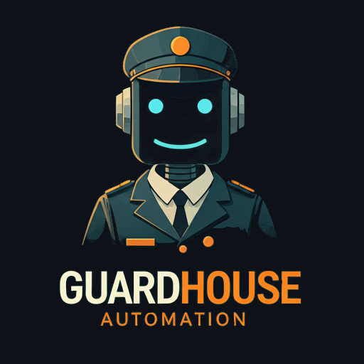

## Descrição

**GuardHouse Automation** é um projeto voltado para a automação e gerenciamento de segurança em portarias e guaritas. Utilizando tecnologias avançadas com LLM, o GuardHouse Automation visa melhorar a eficiência e a segurança dos processos de entrada e saída em edifícios residenciais, comerciais e públicos
A ideia surgiu durante a implatação do controle de acesso do HFAB (Hospital das Forças Aéreas de Brasília), onde os recrutas anotam manualmente as placas e documentos dos visitantes para cadastro posterior. A ideia inicial era automatizar esse processo.
## Funcionalidades

- **Reconhecimento de Placas**: Detecta e reconhece placas de veículos.
- **Reconhecimento de Modelo e Fabricante**: Detecta qual o modelo do carro e qual fabricante.
- **Leitura documentos de identidade**: Captura informações da CNH e documento de identidade do visitante
- **Relatórios**: Gera uma tabela de excel com as placas, modelo, fabricante, nome do condutor, CPF e RG.

## Tecnologias Utilizadas

- **Python**: Linguagem de programação principal.
- **EasyOCR**: Biblioteca para processamento de imagens OCR.
- **YOLOv4**: Modelo de detecção de objetos.
- **FastAPI** : Framework para criação da API de comunicação com o modelo LLM Gemeni Pro 1.5 através da VertexAI
- **Streamlit**: Framework para criar a interface de usuário.
- **Pandas**: Manipulação dos dados e criação da tabela
- **Gemini**: Modelo LLM da Google
- **VertexAI**: API da Google Cloud Service para acessar o modelo Gemini
- **Git**: Controle de versão.
- **GitHub**: Hospedagem do código.

## Instalação

Siga as etapas abaixo para configurar o projeto em sua máquina local:

1. Clone o repositório:
    ```sh
    git clone https://github.com/isaccjr/GuardhouseAutomation.git
    cd GuardhouseAutomation
    ```

2. Crie um ambiente virtual:
    ```sh
    python -m venv env
    source env/bin/activate  # Em Windows, use `env\Scripts\activate`
    ```

3. Instale as dependências:
    ```sh
    pip install -r requirements.txt
    ```

4. Execute a aplicação:
    ```sh
    streamlit run app.py
    ```

5. Execute a API
    ```sh
    uvicorn main:app --reload
    ```

6. Crie um projeto no GCS
    ```sh
    Acesso o GCS e crie um projeto, ative o serviço VertexAI e o crie um bucket
    Troque o nome do seu projeto no codigo e o do bucket também.
    Ative as credenciais para o uso do GCS
    ```

## Notebook

O notebook tem exemplos de como usar o codigo para acessar o serviço VertexAI com imagens locais E o passo a passo de como cheguei na solução. 
Primeiramente mostra uma maneira local de fazer usando
EASYOCR e YOLO, o YOLO detecta onde esta as placas na imagem e o EASYOCR lê a placa. A parte de processamento da saída do easyocr esta por implementar.

## Contribuição

Contribuições são bem-vindas! Siga os passos abaixo para contribuir com o projeto:

1. Faça um fork do repositório.
2. Crie uma nova branch (`git checkout -b feature/sua-feature`).
3. Faça commit das suas alterações (`git commit -m 'Adiciona nova feature'`).
4. Faça push da branch (`git push origin feature/sua-feature`).
5. Abra um Pull Request.

## Licença

Este projeto está licenciado sob a [Licença MIT](LICENSE).

---

Se precisar de mais ajuda ou tiver dúvidas, sinta-se à vontade para abrir uma issue ou entrar em contato. 🚀✨
